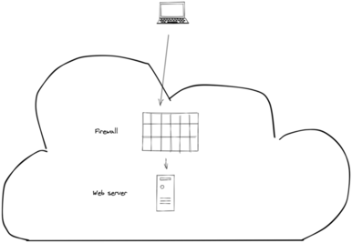

# Palo Alto Automation

This repository contains Ansible playbooks and Terraform deployment files to deploy a test infrastructure in AWS.
The goal of this repository is to provide automatic ways to install a complete infrastructure, from scratch to a production-ready infrastructure, for all the CSPs.

# Schema



# How to use it?

The first thing you have to do is to get your credentials for AWS et set your environment variables accordingly:
```sh
export AWS_ACCESS_KEY_ID="AAAAAAAAAAAAAAAAAAAA"
export AWS_SECRET_ACCESS_KEY="AAAAAAAAAAAAAAAAAAAAAAAAAAAAAAAAAAAAAAAA"
```

## Ansible

### Install dependencies

Of course, you need `ansible`, but you also need `pip` and `ansible-galaxy`, then you can install the dependencies:
```sh
$ make -f Makefile.aws.ansible install
```

### Run the playbooks

Before launching the playbooks, please review the configuration in `aws/build/ansible/inventory.yml`. For example, you may have to change the path of python (`ansible_python_interpreter`) and the AWS region (`aws_region`).

This will launch the `build` playbook, and then the `run` playbook:
```sh
$ make -f Makefile.aws.ansible run
```

### Delete the infrastructure with Ansible

```sh
$ make -f Makefile.aws.ansible delete
```

## Terraform

### Install dependencies

Of course, you need `terraform`, but you also need `go`, then you can install the dependencies:
```sh
$ make -f Makefile.aws.terraform install
```

### Apply the Terraform deployment

Before launching the deployments, please review the configuration in `aws/build/terraform/terraform.tfvars`. For example, you may have to change the AWS region (`aws_region`).

This will launch the `build` deployment, and then the `run` deployment:
```sh
$ make -f Makefile.aws.terraform apply
```

### Destroy the infrastructure with Terraform

```sh
$ make -f Makefile.aws.terraform destroy
```
